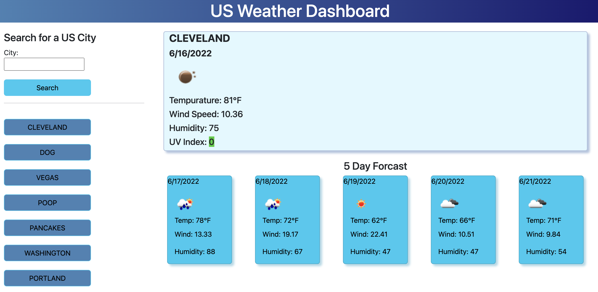

# Project Name - Simple Weather App

## Table of contents

- [Overview](#overview)
  - [The challenge](#the-challenge)
  - [User Story](#user-story)
  - [Acceptance Criteria](#acceptance-criteria)
  - [Screenshot](#screenshot)
  - [Links](#links)
- [My process](#my-process)
  - [Built with](#built-with)
  - [What I learned](#what-i-learned)
  - [Useful resources](#useful-resources)
- [Author](#author)
- [Acknowledgments](#acknowledgments)


## Overview
The Simple Weather App is a weather dashboard that runs in the browser and features dynamically updated HTML and CSS. The weather app includes a search option, a list of cities, and a five-day forecast and current weather conditions for each city.

### The Challenge

In this challenge I used the OpenWeather One Call API to retrieve weather data for cities, and read through the documentation for setup and usage instructions. I used localStorage to store any persistent data, and to dynamically insert that data into the weather app.

### User Story

AS A traveler
I WANT to see the weather outlook for multiple cities
SO THAT I can plan a trip accordingly.

### Acceptance Criteria

```
GIVEN a weather dashboard with form inputs
WHEN I search for a city
THEN I am presented with current and future conditions for that city and that city is added to the search history
WHEN I view current weather conditions for that city
THEN I am presented with the city name, the date, an icon representation of weather conditions, the temperature, the humidity, the wind speed, and the UV index
WHEN I view the UV index
THEN I am presented with a color that indicates whether the conditions are favorable, moderate, or severe
WHEN I view future weather conditions for that city
THEN I am presented with a 5-day forecast that displays the date, an icon representation of weather conditions, the temperature, the wind speed, and the humidity
WHEN I click on a city in the search history
THEN I am again presented with current and future conditions for that city
```

### Screenshot




### Links

- Solution URL: [GitHub](https://github.com/NaNifer/Simple-Weather-App-h6)
- Live Site URL: [Simple Weather App](https://nanifer.github.io/Simple-Weather-App-h6/)

## My process

I set up the HTML bones, and added a little bit of CSS so that I would remember to add classes and ids to my HTML. For the javascript, I broke down each individual task into its own function. This helped me better understand the order of operations within the script, when functions called upon other functions. When I finally got everything working throughout all the paths, I refactored the code and added comments. Finally, I went back in and added some more CSS on top of the Bootstrap so that it would look nicer. 

### Built with

- Semantic HTML5 markup
- CSS
- Bootstrap
- OpenWeather One Call API
- Javascript

### What I learned

My tutor, Trinh Nguyen, showed me this how to insert a block of code dynamically, though adding raw html (string) to the html page and using the backtick shortcuts.

```css
let card = `
    <div id="Forcast-card" class="card text-bg-info mb-3">
        <div class="forcast-date" class="card-header">${dateVal}</div>
        <div class="card-body">
            <div>WEATHER ICON HERE</div>
            <p id="forcast-temp" class="card-title">Temp: ${temp}</p>
            <p id="forcast-wind" class="card-text">Wind:</p>
            <p id="forcast-humidity" class="card-text">Humidity:</p>
        </div>
    </div>
    `
    divContainer.innerHTML += card
```

### Useful resources

- [One Call API 1.0](https://openweathermap.org/api/one-call-api) - provides the following weather data for any geographical coordinates:
  - Current weather
  - Minute forecast for 1 hour
  - Hourly forecast for 48 hours
  - Daily forecast for 7 days
  - National weather alerts
  - Historical weather data for the previous 5 days

- [Geocoding API](https://openweathermap.org/api/geocoding-api) - a tool that pairs with One Call to ease the search for locations while working with geographic names and coordinates.


## Author

- GitHub - [NaNifer](https://github.com/NaNifer)
- Portfolio - [Nifer Kilakila](https://nanifer.github.io/Nifer-Kilakila-Portfolio-h2/)

## Acknowledgments

Many thanks to the TAs, my tutor, Trinh Nguyen, and [nullaus](https://github.com/nullaus) who was my quick dial on all the random questions about JS, and helped me with my click listener when I couldn't focus any more, lol.
